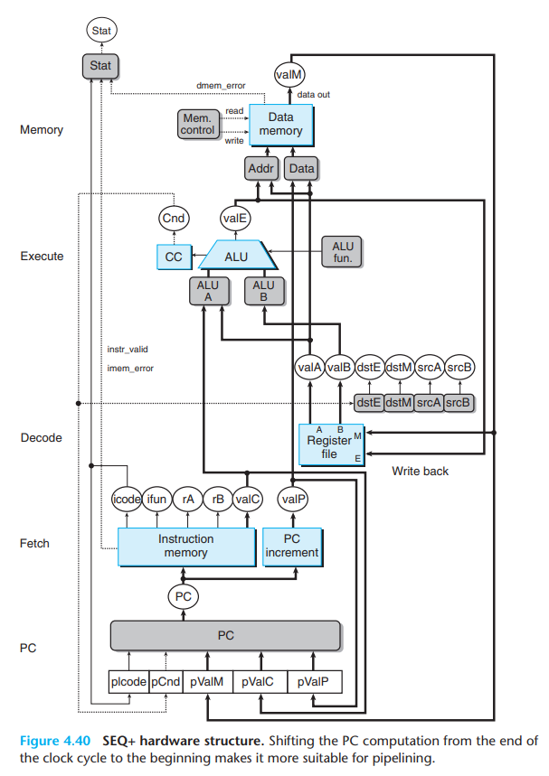
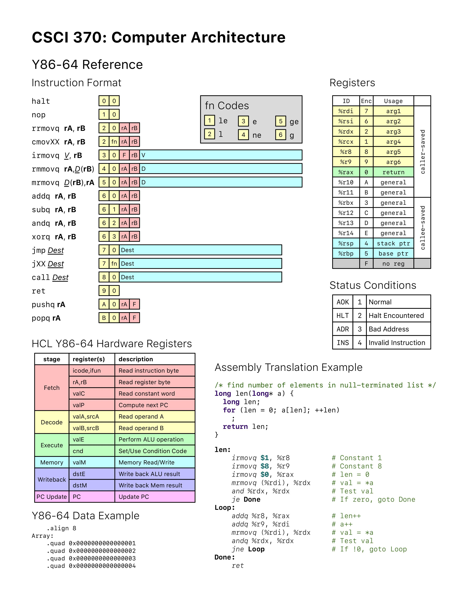

Web模拟器: [y86-64 Simulator](https://boginw.github.io/js-y86-64/)   
项目源代码参见：[Invisiphantom/Y86-64-Single-Cycle](https://github.com/Invisiphantom/Y86-64-Single-Cycle)  
环境配置参见博客：[IVerilog+VSCode环境配置 | Mind City](https://invisiphantom.github.io/Skill/IVerilog+VSCode%E7%8E%AF%E5%A2%83%E9%85%8D%E7%BD%AE/)   
项目解析参见博文：[Y86-64单周期CPU设计 | Mind City](https://invisiphantom.github.io/Skill/Y86-64%E5%8D%95%E5%91%A8%E6%9C%9FCPU%E8%AE%BE%E8%AE%A1/) 

RISC-V单周期CPU源码参见：[Invisiphantom/RISC-V-SIngle-Cycle](https://github.com/Invisiphantom/RISC-V-SIngle-Cycle)   
RISC-V流水线CPU源码参见：[Invisiphantom/RISC-V-Pipeline](https://github.com/Invisiphantom/RISC-V-Pipeline)    
### 整体架构图(csapp P460)

- PC: 选择PCaddress的更新方式(累加or跳转)
- InstMemory: 从内存中取出PCaddress地址处的指令，并将其解析为对应的icode, ifun, rA, rB, valC
- PCIncre: 计算出下一条指令所在的内存地址valP
- Regs: 选择需要读取的寄存器和要写入的寄存器
- ALU_fun: 选择ALU需要执行的运算
- ALU_A: 选择ALU的数据A
- ALU_B: 选择ALU的数据B
- ALU: 执行运算并更新标志位
- CC: 根据标志位判断是否执行jXX或者cmovXX
- MemControl: 判断是否需要读写内存
- MemAddr: 选择读写内存的地址
- MemData: 选择写入内存的数据
- Mem: 执行内存的读写操作
- Stat: 判断CPU是否出现运行时异常

### Y86-64指令集([Y86-64 Reference](https://cs.millersville.edu/~wkillian/archive/2019/fall/files/csci370/Y86-64%20Reference.pdf))

```
         Decode | Execute     |  Memory      |  Writeback
			    | aluB   aluA |              |  
2 rrmovq: rA    | 0   +  rA   |              |  -> rB
3 irmovq:       | 0   +  valC |              |  -> rB
4 rmmovq: rA rB | (rB + valC) | rA => Mem    |
5 mrmovq:    rB | (rB + valC) | Mem ->       |  -> rA
6 ops   : rA rB | rB +-&^ rA  |              |  -> rB

7 jXX   :
8 call  : rRsp  | (rRsp - 8)  | valP => Mem  |  -> rRsp
9 ret   : rRsp  | (rRsp) + 8  | Mem -> pValM |  -> rRsp
A pushq : rRsp  | (rRsp - 8)  | rA => Mem    |  -> rRsp
B popq  : rRsp  | (rRsp) + 8  | Mem -> rA    |  -> rA rRsp
```
- 2 rrmovq 需要读取rA寄存器 需要计算rA+0 不需要读写内存 需要写回rB寄存器
- 3 irmovq 不需要读取寄存器 需要计算valC+0 不需要读写内存 需要写回rB寄存器
- 4 rmmovq 需要读取rA和rB寄存器 需要计算rB+valC 需要将rA寄存器的值写入(rB+valC)地址的内存处 不需要写回寄存器
- 5 mrmovq 需要读取rB寄存器 需要计算rB+valC 需要读取(rB+valC)地址处的内存值 需要写回rA寄存器
- 6 ops 需要读取rA和rB寄存器 需要计算rB+-&^rA 不需要读写内存 需要写回rB寄存器

- 7 jXX
- 8 call 需要读取rRsp寄存器的值 需要计算rRsp-8 需要将valP写入(rRsp-8)地址处的内存 写回rRsp寄存器
- 9 ret 需要读取rRsp寄存器的值 需要计算rRsp+8 需要读取(rRsp)地址处的内存 写回rRsp寄存器
- A pushq 需要读取rA和rRsp寄存器的值 需要计算rRsp-8 需要将rA写入(rRsp-8)地址处的内存 需要写回rRsp寄存器
- B popq 需要读取rRsp寄存器的值 需要计算rRsp+8 需要读取(rRsp)地址处的内存 写回rA和rRsp寄存器


```
ALU flags
ZF: valE == 64'b0
SF: valE[63] == 1'b1
OF: + aluB[63] == aluA[63] && aluB[63] != valE[63]
	- aluB[63] != aluA[63] && aluB[63] != valE[63]
```
- ZF 零标志位 当ALU计算结果为0时置为1 否则置为0
- SF 符号标志位 当ALU计算结果为负数时置为1 否则置为0
- OF 溢出标志位 如果是加法，则当B和A同号且B和valE异号时置为1 否则置为0 | 如果是减法，则当B和A异号且B和valE异号时置为1 否则置为0

```
fn Codes
0 all: 1'b1
1 le : ZF == 1 || SF != OF
2 l  : ZF != OF
3 e  : ZF == 1
4 ne : ZF == 0
5 ge : SF == OF
6 g  : ZF == 0 && SF == OF
```
- 0 all (always)
- 1 le	(less or equal)
- 2 l	(less)
- 3 e	(qeual)
- 4 ne 	(not equal)
- 5 ge 	(greater or equal)
- 6 g	(greater)


### Verilog代码细节

- PC: 选择PCaddress的更新方式，
	- 默认更新为下一条指令的地址处
	- jXX需要根据条件码来判断是否跳转到valC
	- call直接跳转到valC地址处
	- ret跳转到外层函数栈帧地址处
```verilog
module PC (
    input             clk,
    input      [ 3:0] pIcode,
    input             pCnd,      // jXX 判断是否启用
    input      [63:0] pValM,     // ret
    input      [63:0] pValC,     // jmp jXX call
    input      [63:0] pValP,     // normal PC update
    input      [ 2:0] stat,      // 1: AOK, 2: HLT, 3: ADR, 4: INS
    output reg [63:0] PCaddress
);

    initial PCaddress = {64{1'b0}};

    always @(posedge clk) begin
        // 如果出现异常，则停止更新PC
        if (stat != 3'b001) PCaddress <= PCaddress;
        else
            case (pIcode)
                // 将PC更新为下一条指令的地址
                4'h0: PCaddress <= pValP;  // halt
                4'h1: PCaddress <= pValP;  // nop
                4'h2: PCaddress <= pValP;  // rrmovq, cmovXX
                4'h3: PCaddress <= pValP;  // irmovq
                4'h4: PCaddress <= pValP;  // rmmovq
                4'h5: PCaddress <= pValP;  // mrmovq
                4'h6: PCaddress <= pValP;  // addq, subq, andq, xorq
                4'hA: PCaddress <= pValP;  // pushq
                4'hB: PCaddress <= pValP;  // popq

                // 根据条件判断是否跳转
                4'h7: PCaddress <= pCnd ? pValC : pValP;  // jmp, jXX
                // 跳转到valC地址处
                4'h8: PCaddress <= pValC;  // call
                // 跳转到栈帧存储的地址处
                4'h9: PCaddress <= pValM;  // ret
            endcase
    end
endmodule
```

- InstMemory: 从内存中取出PCaddress地址处的指令，并将其解析为对应的icode, ifun, rA, rB, valC
```verilog
module InstMemory (
    input      [63:0] PCaddress,
    input      [ 2:0] stat,
    output reg [ 3:0] icode,
    output reg [ 3:0] ifun,
    output reg [ 3:0] rA,
    output reg [ 3:0] rB,
    output     [63:0] valC,
    output reg instr_valid
);
    // 总共1024字节的内存空间
    parameter MEM_SIZE = 1024;
    reg [7:0] inst_mem[0:MEM_SIZE-1];
    // 使用ROMreplace.py修改至当前绝对路径
    initial $readmemh("/home/ethan/Y86-64-Single-Cycle/ROM.txt", inst_mem);

    wire [79:0] instruction;
    assign instruction[79:0] =
        (stat == 3'b001) ? {
        inst_mem[PCaddress],
        inst_mem[PCaddress+1],
        inst_mem[PCaddress+2],
        inst_mem[PCaddress+3],
        inst_mem[PCaddress+4],
        inst_mem[PCaddress+5],
        inst_mem[PCaddress+6],
        inst_mem[PCaddress+7],
        inst_mem[PCaddress+8],
        inst_mem[PCaddress+9]
    } : {80{1'bx}}; // 如果出现异常，则停止取指

    reg [63:0] valC_litend; // 小端法存储的立即数

    always @(*) begin
        icode = instruction[79:76]; // 4 bits
        ifun  = instruction[75:72]; // 4 bits
        rA    = instruction[71:68]; // 4 bits
        rB    = instruction[67:64]; // 4 bits
        if(icode > 4'hC) instr_valid = 1'b0; // 不合法指令
        else instr_valid = 1'b1;

        case (icode)
            4'd3, 4'd4, 4'd5: valC_litend = instruction[63:0];  // irmovq, rmmovq, mrmovq
            4'd7, 4'd8: valC_litend = instruction[71:8];  // jmp, jXX, call
            default: valC_litend = {64{1'b0}};
        endcase
    end

    // 转换小端法存储的数据
    assign valC = {
        valC_litend[7:0],
        valC_litend[15:8],
        valC_litend[23:16],
        valC_litend[31:24],
        valC_litend[39:32],
        valC_litend[47:40],
        valC_litend[55:48],
        valC_litend[63:56]
    };
endmodule
```

- PCIncre: 计算出下一条指令所在的内存地址valP
```verilog
module PCIncre (
    input [3:0] icode,
    input [63:0] PCaddress,
    output reg [63:0] valP
);

    always @(*) begin
        case (icode)
            4'h0:  valP = PCaddress;  // halt
            4'h1:  valP = PCaddress + 1;  // nop
            4'h2:  valP = PCaddress + 2;  // rrmovq, cmovXX
            4'h3:  valP = PCaddress + 10;  // irmovq
            4'h4:  valP = PCaddress + 10;  // rmmovq
            4'h5:  valP = PCaddress + 10;  // mrmovq
            4'h6:  valP = PCaddress + 2;  // addq, subq, andq, xorq
            4'h7:  valP = PCaddress + 9;  // jmp, jXX
            4'h8:  valP = PCaddress + 9;  // call
            4'h9:  valP = PCaddress + 1;  // ret
            4'hA: valP = PCaddress + 2;  // pushq
            4'hB: valP = PCaddress + 2;  // popq  
        endcase
    end
endmodule
```


- Regs: 选择需要读取的寄存器和要写入的寄存器
```verilog
module Regs (
    input clk,
    input Cnd,
    input [3:0] icode,
    input [3:0] rA,
    input [3:0] rB,
    input [63:0] valE,
    input [63:0] valM,
    output reg [63:0] valA,
    output reg [63:0] valB,
    output [63:0] rax,
    output [63:0] rcx,
    output [63:0] rdx,
    output [63:0] rbx,
    output [63:0] rsp,
    output [63:0] rbp,
    output [63:0] rsi,
    output [63:0] rdi,
    output [63:0] r8,
    output [63:0] r9,
    output [63:0] r10,
    output [63:0] r11,
    output [63:0] r12,
    output [63:0] r13,
    output [63:0] r14
);
    reg [63:0] Register[0:15];
    initial begin
        Register[0]  = 64'h0;
        Register[1]  = 64'h0;
        Register[2]  = 64'h0;
        Register[3]  = 64'h0;
        Register[4]  = 64'h0;
        Register[5]  = 64'h0;
        Register[6]  = 64'h0;
        Register[7]  = 64'h0;
        Register[8]  = 64'h0;
        Register[9]  = 64'h0;
        Register[10] = 64'h0;
        Register[11] = 64'h0;
        Register[12] = 64'h0;
        Register[13] = 64'h0;
        Register[14] = 64'h0;
    end

    always @(*) begin
        case (icode)
            4'h2, 4'h5, 4'h4, 4'h6: begin
                valA <= Register[rA];  // rA
                valB <= Register[rB];  // rB
            end
            4'h8, 4'h9, 4'hB: begin
                valA <= Register[4];  // %rsp
                valB <= Register[4];  // %rsp
            end
            4'hA: begin  // pushq
                valA <= Register[rA];  // rA
                valB <= Register[4];  // %rsp
            end
            default: begin
                valA <= valA;
                valB <= valB;
            end
        endcase
    end

    always @(posedge clk) begin
        case (icode)
            4'h2: begin
                if (Cnd == 1'b1) Register[rB] <= valE;  // rrmovq, cmovXX
            end
            4'h3: Register[rB] <= valE;  // irmovq
            4'h5: Register[rA] <= valM;  // mrmovq
            4'h6: Register[rB] <= valE;  // addq, subq, andq, xorq
            4'h8: Register[4] <= valE;  // call
            4'h9: Register[4] <= valE;  // ret
            4'hA: Register[4] <= valE;  // pushq
            4'hB: begin  // popq
                Register[4]  <= valE;
                Register[rA] <= valM;
            end
        endcase
    end

    assign rax = Register[0];
    assign rcx = Register[1];
    assign rdx = Register[2];
    assign rbx = Register[3];
    assign rsp = Register[4];
    assign rbp = Register[5];
    assign rsi = Register[6];
    assign rdi = Register[7];
    assign r8  = Register[8];
    assign r9  = Register[9];
    assign r10 = Register[10];
    assign r11 = Register[11];
    assign r12 = Register[12];
    assign r13 = Register[13];
    assign r14 = Register[14];
endmodule
```

- ALU_fun: 选择ALU需要执行的运算
```verilog
module ALU_fun (
    input [3:0] icode,
    input [3:0] ifun,
    output reg [1:0] aluFun
);
    always @(*) begin
        case (icode)
            // rrmovq, irmovq, rmmovq, mrmovq
            4'h2, 4'h3, 4'h4, 4'h5: aluFun = 2'b00;
            // ops
            4'h6: aluFun = ifun;
            // call, pushq 计算(rRsp - 8)
            4'h8, 4'hA: aluFun = 2'b01;
            // ret, popq 计算(rRsp) + 8
            4'h9, 4'hB: aluFun = 2'b00;
            default: aluFun = aluFun;
        endcase
    end
endmodule
```

- ALU_A: 选择ALU的数据A
```verilog
module ALU_A (
    input [3:0] icode,
    input [63:0] valC,  // irmovq, rmmovq, mrmovq
    input [63:0] valA,  // rrmovq, cmovXX, ops
    output reg [63:0] aluA
);
    always @(*) begin
        case (icode)
            // irmovq, rmmovq, mrmovq
            4'h3, 4'h4, 4'h5: aluA = valC;
            // rrmovq, ops
            4'h2, 4'h6: aluA = valA;
            // call, ret, pushq, popq 计算 rRsp ± 8
            4'h8, 4'h9, 4'hA, 4'hB: aluA = {{60{1'b0}}, 4'h8};
            default: aluA = aluA;
        endcase
    end
endmodule
```

- ALU_B: 选择ALU的数据B
```verilog
module ALU_B (
    input [3:0] icode,
    input [63:0] valB,  // rmmovq, mrmovq, ops
    output reg [63:0] aluB
);

    always @(*) begin
        case (icode)
            // rrmovq(rA+0), irmovq(valC+0) 
            4'h2, 4'h3: aluB = {64{1'b0}};
            // rmmovq, mrmovq, ops
            4'h4, 4'h5, 4'h6: aluB = valB;
            // call, ret, pushq, popq
            4'h8, 4'h9, 4'hA, 4'hB: aluB = valB;
            default: aluB = aluB;
        endcase
    end
endmodule
```

- ALU: 执行运算并更新标志位
```verilog
module ALU (
    input clk,
    input [3:0] icode,
    input [1:0] aluFun,
    input [63:0] aluA,
    input [63:0] aluB,
    output reg [63:0] valE,
    output reg ZF,  // zero flag
    output reg SF,  // sign flag
    output reg OF  // overflow flag
);
    initial begin
        valE = 64'b0;
        ZF   = 1'b1;
        SF   = 1'b0;
        OF   = 1'b0;
    end

    always @(*) begin
        case (aluFun)
            2'b00: valE = aluB + aluA;
            2'b01: valE = aluB - aluA;
            2'b10: valE = aluB & aluA;
            2'b11: valE = aluB ^ aluA;
        endcase
    end

    always @(posedge clk) begin
        if (icode == 4'h6) begin
            ZF <= (valE == 64'b0) ? 1'b1 : 1'b0;
            SF <= (valE[63] == 1) ? 1'b1 : 1'b0;
            if (aluFun == 2'b00)  // 加法
                OF <= (aluA[63] == aluB[63] && aluB[63] != valE[63]) ? 1'b1 : 1'b0;
            else if (aluFun == 2'b01)  // 减法
                OF <= (aluA[63] != aluB[63] && aluB[63] != valE[63]) ? 1'b1 : 1'b0;
        end else begin
            ZF <= ZF;
            SF <= SF;
            OF <= OF;
        end
    end
endmodule
```

- CC: 根据标志位判断是否执行jXX或者cmovXX
```verilog
module CC (
    input [3:0] ifun,
    input ZF, // zero flag
    input SF, // sign flag
    input OF, // overflow flag
    output reg Cnd // condition code
);
    always @(*) begin
        case (ifun)
            4'h0: Cnd = 1'b1;  // all
            4'h1: Cnd = (ZF == 1 || SF != OF) ? 1'b1 : 1'b0;  // le
            4'h2: Cnd = (SF != OF) ? 1'b1 : 1'b0;  // l
            4'h3: Cnd = (ZF == 1) ? 1'b1 : 1'b0;  // e
            4'h4: Cnd = (ZF == 0) ? 1'b1 : 1'b0;  // ne
            4'h5: Cnd = (SF == OF) ? 1'b1 : 1'b0;  // ge
            4'h6: Cnd = (ZF == 0 && SF == OF) ? 1'b1 : 1'b0;  // g
            default: Cnd = 1'b0;
        endcase
    end
endmodule
```

- MemControl: 判断是否需要读写内存
```verilog
module MemControl (
    input [3:0] icode,
    output reg memWrite,
    output reg memRead
);
    always @(icode) begin
        case (icode)
            // 需要写入内存
            // rmmovq, call, pushq
            4'h4, 4'h8, 4'hA: begin
                memWrite = 1'b1;
                memRead  = 1'b0;
            end
            // 需要读取内存
            // mrmovq, ret, popq
            4'h5, 4'h9, 4'hB: begin
                memWrite = 1'b0;
                memRead  = 1'b1;
            end
            default: begin
                memWrite = 1'b0;
                memRead  = 1'b0;
            end
        endcase
    end
endmodule
```

- MemAddr: 选择读写内存的地址
```verilog
module MemAddr (
    input [3:0] icode,
    input [63:0] valE,
    input [63:0] valA,
    output reg [63:0] memAddr
);
    always @(*) begin
        case (icode)
            // rmmovq, mrmovq, call, pushq
            4'h4, 4'h5, 4'h8, 4'hA: memAddr <= valE;
            // ret, popq
            4'h9, 4'hB: memAddr <= valA; // (rRsp)
            default: memAddr <= 64'hxxxxxxxxxxxxxxxx;
        endcase
    end
endmodule
```

- MemData: 选择需要写入内存的数据
```verilog
module MemData (
    input [3:0] icode,
    input [63:0] valP,
    input [63:0] valA,
    output reg [63:0] memData
);
    always @(*) begin
        case (icode)
            // call
            4'h8: memData = valP;
            // rmmovq, pushq
            4'h4, 4'hA: memData = valA;
        endcase
    end
endmodule
```

- Mem: 执行内存的读写操作
```verilog
module Mem (
    input memWrite,
    input memRead,
    input [63:0] memAddr,
    input [63:0] memData,
    output reg [63:0] valM,
    output reg dmem_error
);
    // 总共1024字节的内存空间
    parameter MEM_SIZE = 1024;
    reg [7:0] mem[0:MEM_SIZE-1];
    // 使用ROMreplace.py修改至当前绝对路径
    initial $readmemh("/home/ethan/Y86-64-Single-Cycle/ROM.txt", mem);

    always @(memRead or memWrite or memAddr or memData) begin
        #1;  // 消除memAddr和memData的抖动
        if (memAddr >= MEM_SIZE) dmem_error <= 1'b1;
        else begin
            dmem_error <= 1'b0;
            // 小端法读写内存数据
            if (memRead == 1'b1)
                valM <= {
                    mem[memAddr+7],
                    mem[memAddr+6],
                    mem[memAddr+5],
                    mem[memAddr+4],
                    mem[memAddr+3],
                    mem[memAddr+2],
                    mem[memAddr+1],
                    mem[memAddr]
                };
            else if (memWrite == 1'b1) begin
                {mem[memAddr + 7], mem[memAddr + 6], mem[memAddr + 5], mem[memAddr + 4], mem[memAddr + 3], mem[memAddr + 2], mem[memAddr + 1], mem[memAddr]} <= memData;
                // 打印内存写入信息
                $display("mem %d %d", memAddr, memData);
            end
        end
    end
endmodule
```

- Stat: 判断CPU是否出现运行时异常
  - AOK: 正常运行
  - HLT: 执行HLT指令
  - ADR: 访问非法地址
  - INS: 读取非法指令
```verilog
module Stat (
    input [3:0] icode,  // HLT
    input instr_valid,
    input imem_error,
    input dmem_error,
    output reg [2:0] stat  // 1: AOK, 2: HLT, 3: ADR, 4: INS
);
    initial stat = 3'b001;
    always @(icode or dmem_error) begin
        #1;  // 延迟写入使得output能与测试答案匹配
        if (stat == 3'h1) begin
            if (icode == 4'h0) stat <= 3'h2;  // HLT
            else if (dmem_error == 1'b1) stat <= 3'h3;  // ADR
            else if (instr_valid == 1'b0) stat <= 3'h4;  // INS
            else stat <= stat;  // AOK
        end
    end
endmodule
```

- arch: Y86-64单周期CPU顶层模块
- arch_tb: 顶层模块的测试模块
```verilog
module arch (
    input clk
);

    wire pCnd;
    wire [3:0] pIcode;
    wire [63:0] pValC;
    wire [63:0] pValP;
    wire [63:0] pValM;
    wire [2:0] stat;
    wire [63:0] PCaddress;
    PC u_PC (
        .clk      (clk),
        .pIcode   (pIcode),
        .pCnd     (pCnd),
        .pValC    (pValC),
        .pValP    (pValP),
        .pValM    (pValM),
        .stat     (stat),
        .PCaddress(PCaddress)
    );

    wire [ 3:0] icode;
    wire [ 3:0] ifun;
    wire [ 3:0] rA;
    wire [ 3:0] rB;
    wire [63:0] valC;
    assign pIcode = icode;
    assign pValC  = valC;
    wire instr_valid;
    InstMemory u_InstMemory (
        .PCaddress  (PCaddress),
        .stat       (stat),
        .icode      (icode),
        .ifun       (ifun),
        .rA         (rA),
        .rB         (rB),
        .valC       (valC),
        .instr_valid(instr_valid)
    );


    wire [63:0] valP;
    assign pValP = valP;
    PCIncre u_PCIncre (
        .icode    (icode),
        .PCaddress(PCaddress),
        .valP     (valP)
    );

    wire Cnd;
    wire [63:0] valE;
    wire [63:0] valM;
    wire [63:0] valA;
    wire [63:0] valB;
    assign pCnd  = Cnd;
    assign pValM = valM;
    wire signed [63:0] rax, rcx, rdx, rbx, rsp, rbp, rsi, rdi, r8, r9, r10, r11, r12, r13, r14;
    Regs u_Regs (
        .clk  (clk),
        .Cnd  (Cnd),
        .icode(icode),
        .rA   (rA),
        .rB   (rB),
        .valE (valE),
        .valM (valM),
        .valA (valA),
        .valB (valB),
        .rax  (rax),
        .rcx  (rcx),
        .rdx  (rdx),
        .rbx  (rbx),
        .rsp  (rsp),
        .rbp  (rbp),
        .rsi  (rsi),
        .rdi  (rdi),
        .r8   (r8),
        .r9   (r9),
        .r10  (r10),
        .r11  (r11),
        .r12  (r12),
        .r13  (r13),
        .r14  (r14)
    );


    wire [1:0] aluFun;
    ALU_fun u_ALU_fun (
        .icode (icode),
        .ifun  (ifun),
        .aluFun(aluFun)
    );

    wire [63:0] aluA;
    ALU_A u_ALU_A (
        .icode(icode),
        .valC (valC),
        .valA (valA),
        .aluA (aluA)
    );

    wire [63:0] aluB;
    ALU_B u_ALU_B (
        .icode(icode),
        .valB (valB),
        .aluB (aluB)
    );

    wire ZF, SF, OF;
    ALU u_ALU (
        .clk   (clk),
        .icode (icode),
        .aluFun(aluFun),
        .aluA  (aluA),
        .aluB  (aluB),
        .valE  (valE),
        .ZF    (ZF),
        .SF    (SF),
        .OF    (OF)
    );

    CC u_CC (
        .ifun(ifun),
        .ZF  (ZF),
        .SF  (SF),
        .OF  (OF),
        .Cnd (Cnd)
    );

    wire memWrite, memRead;
    MemControl u_MemControl (
        .icode   (icode),
        .memWrite(memWrite),
        .memRead (memRead)
    );

    wire [63:0] memAddr;
    MemAddr u_MemAddr (
        .icode  (icode),
        .valE   (valE),
        .valA   (valA),
        .memAddr(memAddr)
    );

    wire [63:0] memData;
    MemData u_MemData (
        .icode  (icode),
        .valP   (valP),
        .valA   (valA),
        .memData(memData)
    );

    wire dmem_error;
    Mem u_Mem (
        .memWrite  (memWrite),
        .memRead   (memRead),
        .memAddr   (memAddr),
        .memData   (memData),
        .valM      (valM),
        .dmem_error(dmem_error)
    );

    wire imem_error;

    Stat u_Stat (
        .icode      (icode),
        .instr_valid(instr_valid),
        .imem_error (imem_error),
        .dmem_error (dmem_error),
        .stat       (stat)
    );
endmodule


module arch_tb;
    reg clk;

    arch arch_inst (.clk(clk));

    // 监视PCaddress地址，寄存器状态，标志位状态，CPU运行时状态
    initial begin
        $monitor("%d %d %d %d %d %d %d %d %d %d %d %d %d %d %d %d %d %d %d %d",
                 arch_tb.arch_inst.PCaddress, arch_tb.arch_inst.rax, arch_tb.arch_inst.rcx,
                 arch_tb.arch_inst.rdx, arch_tb.arch_inst.rbx, arch_tb.arch_inst.rsp,
                 arch_tb.arch_inst.rbp, arch_tb.arch_inst.rsi, arch_tb.arch_inst.rdi,
                 arch_tb.arch_inst.r8, arch_tb.arch_inst.r9, arch_tb.arch_inst.r10,
                 arch_tb.arch_inst.r11, arch_tb.arch_inst.r12, arch_tb.arch_inst.r13,
                 arch_tb.arch_inst.r14, arch_tb.arch_inst.ZF, arch_tb.arch_inst.SF,
                 arch_tb.arch_inst.OF, arch_tb.arch_inst.stat);
        repeat (100) begin
            clk = 0;
            #5;
            clk = 1;
            #5;
        end
        $finish;
    end

    initial begin
        $dumpfile("wave.vcd");
        $dumpvars;
    end
endmodule
```

### 使用Python脚本自动格式化输入输出

> 使用方式：打开Y86-output-batch.py文件，使用`Ctrl+Alt+N`快速执行代码，如果测试输出与答案完全匹配，则终端输出`All tests passed!`

```python
#!/usr/bin/env python3
import os
import shutil

os.chdir(os.path.dirname(os.path.abspath(__file__)))

test_path = "./test"
yo_files = os.listdir(test_path)

# 清空output_path文件夹中的内容
output_path = "./Y86-output"
shutil.rmtree(output_path)
os.mkdir(output_path)

# 将InstMemory.v和Mem.v中$readmemh()的ROM.txt路径替换为当前的绝对路径
os.system("python3 -u ROMreplace.py")

# 对每个测试文件进行测试，并将结果保持到Y86-output文件夹中
for yo_file in yo_files:
    # 将test文件夹中的测试文件复制到当前目录下
    with open(os.path.join(test_path, yo_file), "r") as yo_file_IO:
        yo_content = yo_file_IO.readlines()
        
    with open("ROM.yo", "w") as ROM_file:
        ROM_file.write("".join(yo_content))

    # 移除之前生成的文件
    os.system("rm -f ROM.txt ROM_M.txt Y86-output.txt Y86-output.yml")
    # 读取ROM.yo文件，将其中的汇编指令转换为ROM.txt和ROM_M.txt文件中的字节编码
    os.system("python3 -u ROMdraw.py")
    # 执行仿真，并将输出结果写入Y86-output.txt文件
    os.system("iverilog -y $PWD arch.v -o bin/arch && cd bin && rm -f *.vcd && vvp arch > ../Y86-output.txt && rm arch && cd ..")
    # 读取ROM_M.txt和Y86-output.txt文件，将其中的状态转换为Y86-output.yml格式
    os.system('python3 -u Y86-output.py')
    
    # 将Y86-output.yml文件中的内容保存到Y86-output文件夹中
    with open("Y86-output.yml", "r") as yml_file:
        yml_content = yml_file.readlines()

    with open(os.path.join(output_path, yo_file.replace(".yo", ".yml")), "w") as yml_file:
        yml_file.write("".join(yml_content))

# 比较Y86-output文件夹和Y86-answer文件夹中的内容是否相同
os.system('python3 -u Y86-output-diff.py')
```